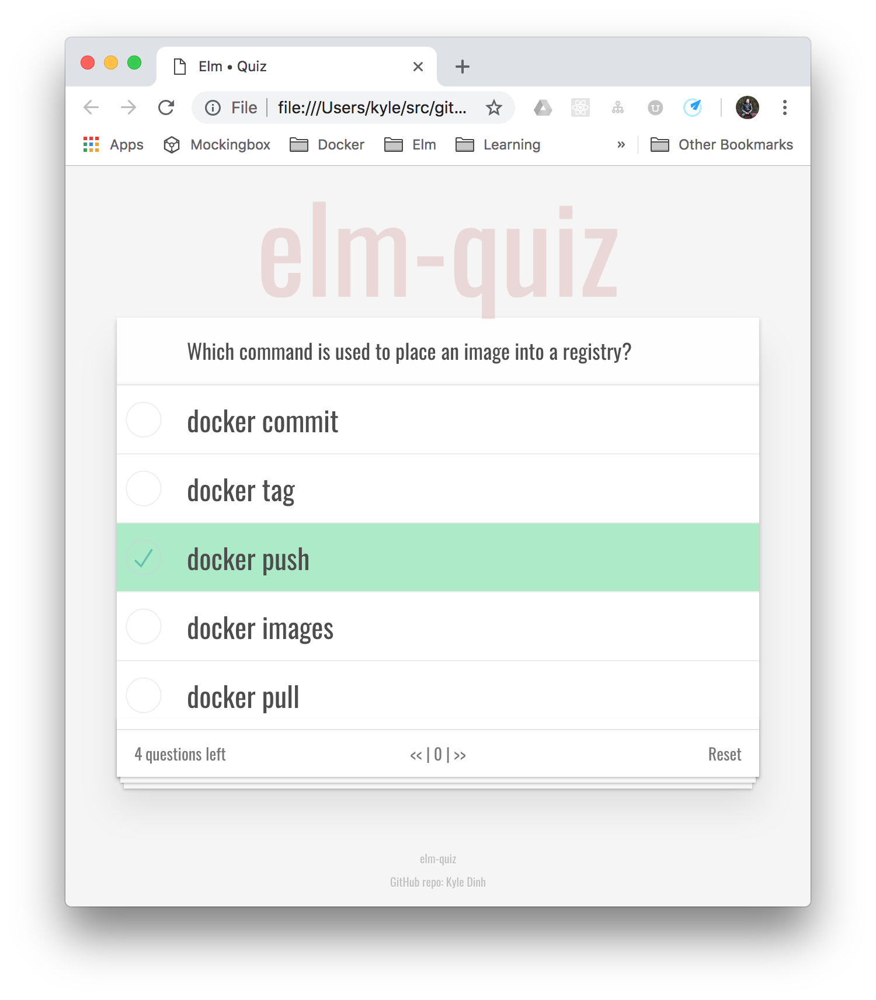

# Elm Quiz

> Goal: build a quiz taking app, use json file as source for questions/answers

This project is based on [TodoMVC](https://github.com/evancz/elm-todomvc) - [Try TodoMVC!](http://evancz.github.io/elm-todomvc)

Features to build:

* [x] an exam contains many entries
* [x] entries contain a question and multiple choices and a correct answer
* [x] UI will display one entry at a time
* [x] can select a choice for each entry
* [x] can navigate through entries in exam
* [ ] grade the exam, show number of correct/wrong
* [ ] source the exam from JSON file
* [x] can reset the exam
* [ ] hints/clues/notes for each entry
* [ ] customize the UI/CSS for unique look

## Dev Notes

* Use Elm 19 to build - `/build.sh` or `elm make src/Quiz.elm --output=elm.js`
* Then open `index.html` in your browser!

Docker command:
* `docker run -it -v ${PWD}:/usr/src/app -p 8080:8080 kyledinh/elm:latest bash`
